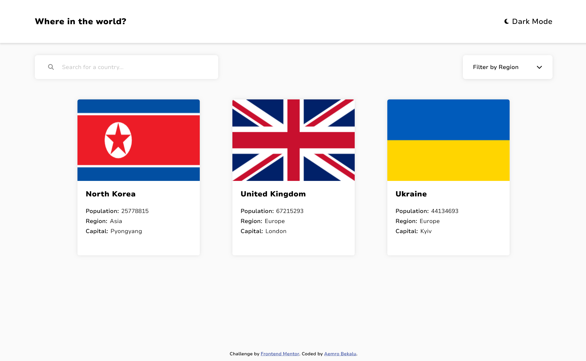
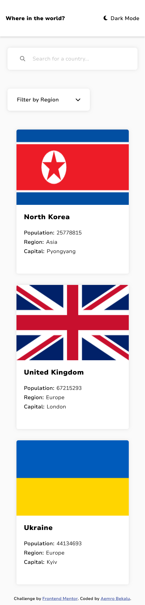

# Frontend Mentor - REST Countries API with color theme switcher solution

This is a solution to the [REST Countries API with color theme switcher challenge on Frontend Mentor](https://www.frontendmentor.io/challenges/rest-countries-api-with-color-theme-switcher-5cacc469fec04111f7b848ca). Frontend Mentor challenges help you improve your coding skills by building realistic projects.

## Table of contents

- [Overview](#overview)
  - [The challenge](#the-challenge)
  - [Screenshot](#screenshot)
  - [Links](#links)
- [My process](#my-process)
  - [Built with](#built-with)
  - [What I learned](#what-i-learned)
  - [Continued development](#continued-development)
- [Author](#author)

## Overview

### The challenge

Users should be able to:

- See all countries from the API on the homepage
- Search for a country using an `input` field
- Filter countries by region
- Click on a country to see more detailed information on a separate page
- Click through to the border countries on the detail page
- Toggle the color scheme between light and dark mode _(optional)_

### Screenshot

- desktop view
  

- mobile view
  

### Links

- Solution URL: [Add solution URL here](https://your-solution-url.com)
- Live Site URL: [live site URL](https://rest-countries-api-aemro.netlify.app/)

## My process

### Built with

- Semantic HTML5 markup
- CSS custom properties
- Flexbox
- CSS Grid
- Mobile-first workflow
- MVC archteicture

### What I learned

I learned how to use js in mvc archteicture and many concept of js within that.

### Continued development

I want to learn React and practive my js problem solving skill

## Author

- Frontend Mentor - [@aemrobe](https://www.frontendmentor.io/profile/aemrobe)
- Twitter - [@Aemro112](https://www.twitter.com/Aemro112)
